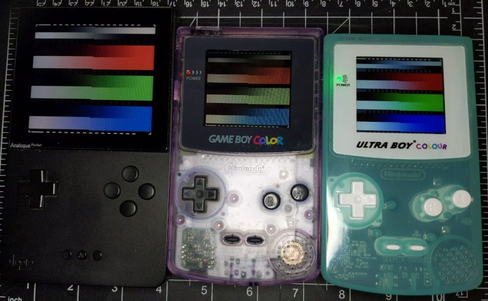
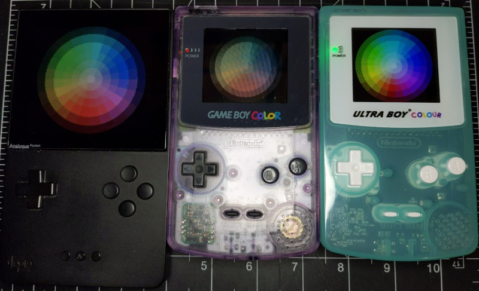

# Game Boy Color Bar and Wheel Test Images

The first two color bar patterns (RGB, CMYK) have exactly 32 colors in each horizontal gradient. 
- For some screens, such as OEM non-backlit GBC, it may be difficult to distinguish between adjacent color gradations.
- If colors are missing or misaligned to the grey reference blocks then the screen or emulation color depth may not be accurate or may be clipped.
- Some emulators may shift the rendered GBC colors up or down a value before displaying.

## Download ROM

The ROM can be downloaded for free from itch.io
https://bbbbbr.itch.io/gbc-colorbars

## Screenshots

Built with GBDK

